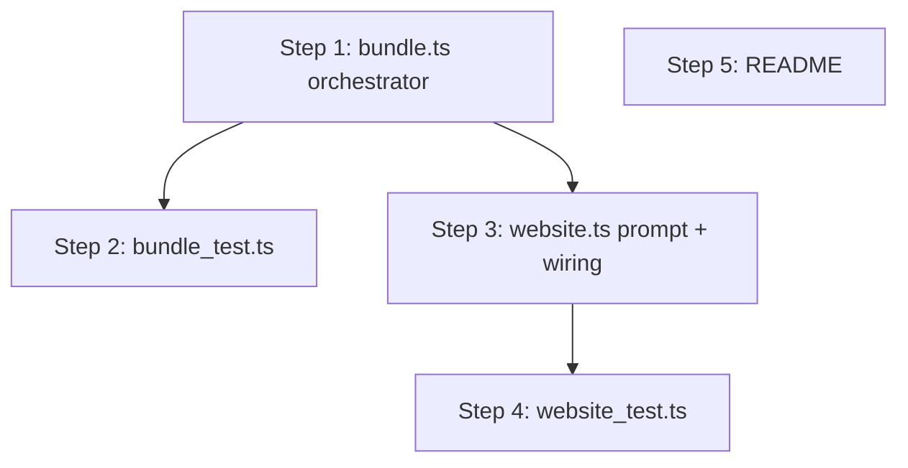

# Implementation Plan — Skill bundle for `huuma project website`

> Derived from `docs/CONTEXT.md` (glossary — `Skill bundle`) and
> `docs/adr/0002-skill-bundle-for-project-scaffolding.md` (decisions). Read
> both first — this plan does not re-justify the install pipeline or the
> bundle's load-bearing decisions, it sequences the _bundle_ layer on top
> of the existing `src/skills/` modules.

## Goal

When a user runs `huuma project` and selects the `website` type, an opt-in
prompt offers a **skill bundle** from `huuma-studio/ui`'s `skills/`
directory. On accept, every subdirectory of that `skills/` subpath that
contains a valid `SKILL.md` is installed into the new project's
`.agents/skills/<name>/` and recorded in the manifest — atomically. If any
member fails validation, none of the bundle is installed.

The bundle is the _input_ set; the _registry_ (`.agents/skills/` +
`.manifest.json`) is the resulting installed set. Each member becomes a
normal manifest entry indistinguishable from one written by
`huuma skills add`, so a future `huuma skills update` can re-fetch members
individually.

## Conventions

- **Reuse the existing skills leaf modules**: `path.ts`, `validate.ts`,
  `manifest.ts`, `extract.ts`, `fetch.ts`, `fs_utils.ts`. No new dependencies
  in `deno.json` — `@std/tar`, `@std/front-matter`, `@std/yaml`, `@std/cli`,
  `@std/path` are already pinned.
- **No new CLI subcommand.** The bundle installer is an internal module
  consumed by the `website` project type. Surfacing it as
  `huuma skills add-bundle` is out of scope (see below).
- **Output style**: matches the existing skills flow — `dim("… ")` progress
  lines, `green("✓")` success, `yellow("⚠ ")` per-member warnings,
  `red("✖")` + `Deno.exitCode = 1` on failure.
- **Tests**: no live network. The bundle orchestrator accepts an injected
  `fetch` seam (mirrors `installSkill`'s seam). Tests build multi-skill
  tarballs in-memory with `@std/tar`'s `TarStream`, exactly like
  `install_test.ts`. No binary fixtures.
- **Project-scaffolding context**: the new project dir is the install root.
  `installBundle` is called with `cwd: projectName` (relative — `installSkill`
  already takes `cwd` as a parameter and builds paths with `join(cwd, ...)`).

## File map (new + modified)

```
cli/
├── README.md                          [modify] note the skills-bundle prompt + resulting .agents/skills/ tree
├── docs/feature/add-skills-to-project-creation/
│   └── PLAN.md                        [new] this plan
└── src/
    ├── skills/
    │   ├── bundle.ts                   [new] installBundle orchestrator (one fetch, multi-member, all-or-nothing)
    │   └── bundle_test.ts              [new] in-memory tarball tests: fresh bundle, mixed valid/invalid, no-SKILL.md skip, atomic abort
    └── project/types/
        ├── website.ts                  [modify] add `Add skills bundle from @huuma/ui?` confirm; on yes, call installBundle
        └── website_test.ts            [modify] assert the bundle flag threads through the prompt decision (no network)
```

No changes to `src/skills/install.ts`, `src/skills/add.ts`, `src/mod.ts`,
`deno.json`, or any skills leaf module — the bundle orchestrator composes
them, it does not modify them.

## Implementation order

Sequenced so each step depends only on earlier ones. Tests written alongside
each module.

### Dependency graph



### Parallelisable batches

- **Batch A**: Step 1 (`bundle.ts`) — self-contained, depends only on
  existing `src/skills/*` modules. Can be built and unit-tested in
  isolation with the in-memory tarball seam.
- **Batch B** (after Step 1): Steps 3 and 2 in parallel — `website.ts`
  wiring consumes `installBundle`'s signature; `bundle_test.ts` exercises
  the orchestrator end-to-end. Disjoint write sets.
- **Batch C**: Step 4 (after Step 3) and Step 5 (independent) can land any
  time.

### Module contract ground rules

- **`installBundle` lives in `src/skills/bundle.ts`** and imports only the
  existing skills leaf modules. No leaf module imports `bundle.ts`. The
  website type is the sole caller (for now).
- **Each bundle member is recorded as a standalone `ManifestEntry`** whose
  `source.subpath` is `["skills", <memberName>]`. This makes a bundle
  install look identical (in the registry) to N individual
  `huuma skills add` calls, so a future `huuma skills update` doesn't need
  to know about bundles.
- **All-or-nothing is strict up to the swap phase**: any validation failure
  aborts before any member is moved into `.agents/skills/`. Post-swap disk
  failures (mid-bundle rename) trigger best-effort rollback of already
  swapped members; if rollback itself fails, the next `sweepStaleTemps`
  cleans up — matching the existing single-skill orchestrator's stance.
- **Bundle source is hard-coded for v1**: `huuma-studio/ui` at ref `main`
  (`https://github.com/huuma-studio/ui/tree/main/skills`). `huuma-studio/ui`
  does not publish git version tags, so the ref is the `main` branch — same
  pattern as the skills-management ADR's canonical example
  (`anthropics/skills@main`). This makes bundle installs reproducible only
  at point-in-time (a later `main` commit yields different members); a
  future `huuma skills update` re-fetches from `main` and compares content
  hashes, which is how drift is detected. The `@huuma/ui` _JSR version_
  pinned in the scaffolded `deno.json` is unrelated and resolved
  separately via the existing `latest()` helper.
- **No new testdata fixtures**: `bundle_test.ts` builds tarballs in-memory,
  matching the convention established by `install_test.ts`. If a fixture
  is later needed for documentation, it goes under
  `src/skills/testdata/`, not the repo root.

### Step 1 — `src/skills/bundle.ts` (new orchestrator)

Composes the existing leaf modules to install a _set_ of skills from a
single GitHub source in one atomic operation.

- Types:
  ```ts
  export interface BundleOptions {
    parsed: ParsedPath; // subpath MUST be ["skills"] for the website bundle
    cwd: string; // project root (relative or absolute)
    /** Test seam: injected fetch, same shape as installSkill's. Defaults to
     * the real `downloadTarball`. */
    fetch?: (url: string) => Promise<ReadableStream<Uint8Array>>;
    /** Progress/success sink (default console.log). */
    log?: (line: string) => void;
  }
  export interface BundleMember {
    name: string;
    target: string;
    warnings: string[];
  }
  export interface BundleResult {
    members: BundleMember[]; // empty if the source had no valid members
  }
  export class BundleValidationError extends Error {
    /* name set */
  }
  ```
- `installBundle(opts: BundleOptions): Promise<BundleResult>` flow:
  1. `log(dim("… Resolving <owner>/<repo>@<ref>"))`.
  2. `skillsDir = join(cwd, ".agents", "skills")`; `Deno.mkdir(skillsDir,
{ recursive: true })`; `sweepStaleTemps(skillsDir)`.
  3. `downloadTarball(codeloadUrl(parsed))` (single network call) via the
     injected `fetch`.
  4. Create `tempRoot = join(skillsDir, ".tmp-" + randomSuffix())` and
     `staging = join(tempRoot, "staging")`. Extract once with
     `extractSkill({ tarball, subpath: parsed.subpath, destDir: staging })`.
     With `subpath: ["skills"]`, `extractSkill`'s `stripAndFilter` keeps
     every entry under `skills/` and strips that prefix, so `staging/`
     ends up containing `<memberName>/SKILL.md`, `<memberName>/scripts/`,
     etc. — one dir per member.
  5. `log(dim("… Discovering skill bundle members"))`. Walk `staging/` for
     immediate subdirectories that contain a `SKILL.md` file. Non-skill
     entries (README-only dirs, dotfiles, files at the staging root) are
     silently skipped — only subdirs with `SKILL.md` are candidates.
  6. **Validation phase** — for each candidate, in deterministic (sorted)
     order: call `validateSkill(staging/<memberName>)`. Collect
     `{ name, warnings, sourceDir }` on success. On any
     `ValidationError`: `log(red("✖ …"))`, `Deno.exitCode = 1`, recursively
     remove `tempRoot`, throw `BundleValidationError` (wrapping the cause).
     **No member is moved into `.agents/skills/` until every member has
     validated** — this is the all-or-nothing guarantee from `docs/CONTEXT.md`.
  7. **Swap phase** — for each validated member, in the same sorted order:
     `target = join(skillsDir, validatedName)`;
     `log(dim("… Installing .agents/skills/<name>/"))`;
     `swapDirectory({ tempDir: join(staging, memberName), target })`.
     Track successfully swapped members in a `swapped: BundleMember[]`
     list. On any error mid-swap: best-effort rollback — for each entry in
     `swapped`, attempt `Deno.rename(target, <staging path>)` to put it
     back; if rollback rename fails, log a `yellow` warning and leave it
     for `sweepStaleTemps`. Then remove `tempRoot` and rethrow.
  8. Remove the now-empty `tempRoot`.
  9. **Manifest write** — read the manifest once, then for each member
     compute `contentHashOf(target)` and build a `ManifestEntry` with
     `source = { owner, repo, ref, subpath: [...parsed.subpath, name] }`
     and `installedAt = new Date().toISOString()`. Single `writeManifest`
     call with all entries merged. One I/O, not N.
  10. Return `{ members }`.
- Re-exports `ValidationError` (from `validate.ts`) so the caller can
  catch typed validation failures without importing the leaf directly —
  mirrors `install.ts`'s pattern.

**Depends on**: existing skills modules (no new deps).
**Blocks**: Steps 2, 3.
**Verify**: `deno check src/skills/bundle.ts` passes; the function is
importable. (Behavioural verification is Step 2.)

### Step 2 — `src/skills/bundle_test.ts`

Mirrors `install_test.ts`'s style — in-memory tarballs via `TarStream`, no
network, temp-dir cleanup in `finally`.

- A `buildBundleTarball(members: { name: string; description?: string }[])`
  helper that emits `repo-main/skills/<name>/SKILL.md` for each member plus
  a sibling `repo-main/skills/not-a-skill/README.md` (no `SKILL.md`) and a
  root `repo-main/README.md`. Default `description` is `"<name> skill"`.
- Tests:
  1. **Fresh bundle install**: two valid members (`mcp-builder`,
     `domain-modeling`). Assert both land at
     `<cwd>/.agents/skills/<name>/SKILL.md`, both have manifest entries
     with `source.subpath = ["skills", "<name>"]` and `sha256-` hashes,
     and `not-a-skill/` is _not_ installed. No stray `.tmp-`/`.old-` dirs.
  2. **Empty bundle**: source has `skills/` with no `SKILL.md` anywhere
     (only `not-a-skill/`). `installBundle` succeeds with `members: []`,
     manifest unchanged, no skill dirs created.
  3. **Atomic abort on invalid member**: tarball with two members where
     the second has `name: Bad_Name`. Assert
     `installBundle` rejects with `BundleValidationError`, neither
     member is installed, no skill dirs exist under `.agents/skills/`,
     and no `.tmp-` dir is left behind.
  4. **Warnings propagate**: a member whose `SKILL.md` has
     `compatibility: <500+ chars` installs but its `warnings` array
     contains the compatibility warning. The other member's warnings
     stay empty.
  5. **Manifest is written once with all entries**: after a 3-member
     bundle, the manifest has exactly 3 entries and one atomic file write
     happened (asserted indirectly by checking the manifest's
     `installedAt` timestamps are equal — same `new Date()` call).
  6. **Subpath is correct per member**: each manifest entry's
     `source.subpath` is `["skills", memberName]`, _not_ the bundle's
     `["skills"]` — so each entry is independently update-able.
  7. **Path-traversal in one member aborts the whole bundle**: a member
     dir contains a `../escape.txt` entry; `extractSkill` throws, the
     orchestrator catches it, removes the temp dir, rethrows. No files
     outside `.agents/skills/`, no skill dirs installed.

**Depends on**: Step 1.
**Blocks**: none (independently verifiable).
**Verify**: `deno test src/skills/bundle_test.ts` passes; manual `ls`
after each test confirms no stray dirs in the temp `cwd`.

### Step 3 — Wire the bundle into `src/project/types/website.ts`

The website type already prompts for `.zed`, `.vscode`, and Tailwind. Add
one more `confirm` prompt and a guarded call to `installBundle`.

- Import `installBundle` from `../../skills/bundle.ts` and `parsePath`,
  `PathParseError` from `../../skills/path.ts`.
- The bundle ref is hard-coded `main` (see ground rules). No `latest()`
  call is needed for the ref; the existing `latest("@huuma/ui", "^0.2")`
  call for the scaffolded `deno.json`'s dependency version is unrelated
  and stays as-is.
- Default-export flow, after the existing `if (addTailwind) { … }` block:
  ```ts
  const addSkillsBundle = await confirm("Add skills bundle from @huuma/ui?");
  if (addSkillsBundle) {
    const result = await installBundleForWebsite(projectName);
    if (result.members.length === 0) {
      console.log(
        yellow("  ⚠ No skills found in @huuma/ui's skills/ directory."),
      );
    } else {
      console.log(
        green("✓") +
          ` Installed ${result.members.length} skill${result.members.length === 1 ? "" : "s"} from @huuma/ui:`,
      );
      for (const m of result.members) {
        console.log(`    ${m.name}`);
        for (const w of m.warnings) console.log(yellow("    ⚠ " + w));
      }
    }
  }
  ```
- A small `installBundleForWebsite(projectName)` helper that:
  1. Builds the GitHub tree URL
     `https://github.com/huuma-studio/ui/tree/main/skills` and calls
     `parsePath`.
  2. Calls `installBundle({ parsed, cwd: projectName, log: console.log })`.
  3. On `BundleValidationError` or any thrown error: log `red("✖ …")`,
     set `Deno.exitCode = 1`, and return `{ members: [] }` — the scaffold
     itself still succeeds (the project files are already written). A
     failed bundle is a warning, not a fatal project-creation failure.
     This non-fatal stance is decided: skills are an enhancement, not a
     project requirement. See the ADR §"Failure severity".

  Note: `parsePath` cannot throw on the hard-coded `main` URL (no dynamic
  component), so no defensive try/catch is needed around it. If the URL
  ever becomes dynamic (e.g. a future `--skills-ref` flag), revisit.

- The existing `"Website application created!"` return string stays the
  last line. The bundle summary prints before it.
- Add `green`, `red`, `yellow` to the existing `terminal.ts` imports in
  this file (currently it only imports `confirm`).

**Depends on**: Step 1 (for `installBundle`).
**Blocks**: Step 4.
**Verify**: `deno check src/project/types/website.ts` passes; manual
scaffold (see Final validation) prints the bundle prompt and installs.

### Step 4 — Extend `src/project/types/website_test.ts`

The existing tests assert `denoConfigContent`/`rootTsContent`/`devTsContent`
output. Add tests for the bundle wiring without touching the network.

- The bundle-prompt + `installBundle` call lives in the default export
  (interactive, hard to unit-test without stdin plumbing). Rather than
  spike a fake-confirm seam into `website.ts` for v1, the tests cover the
  pieces that are pure functions or that can be exercised through small
  seams:
  1. **`installBundleForWebsite` propagates `installBundle` results**: pass
     a `bundle` function seam (an optional param) that returns a fixed
     `BundleResult`; assert the helper returns it unchanged. This keeps
     the test hermetic — no network, no real GitHub fetch.
  2. **`installBundleForWebsite` swallows bundle errors and returns `[]`**:
     pass a `bundle` seam that throws a `BundleValidationError`; assert the
     helper sets `Deno.exitCode = 1`, logs a red line, and returns
     `{ members: [] }` — the scaffold's non-fatal contract.
- The `bundle?` seam on `installBundleForWebsite` is the minimal surface
  to make the helper unit-testable. The default export still calls it
  with no seam in production. Document the seam with a comment matching
  `add.ts`'s `AddDeps` style. No `ref?` seam is needed — the ref is
  hard-coded `main`, so there's nothing dynamic to inject.

**Depends on**: Step 3.
**Blocks**: none.
**Verify**: `deno test src/project/types/website_test.ts` passes; existing
tests stay green.

### Step 5 — README

- In the `## Project` section (or wherever the website type's prompts are
  listed), add a one-line note: the scaffold asks `Add skills bundle from
@huuma/ui?` and, on yes, installs every valid skill from
  `huuma-studio/ui`'s `skills/` directory into the new project's
  `.agents/skills/`.
- Cross-reference the existing `## Skills` section (added by the
  skills-management PLAN) so the reader sees that the bundle uses the same
  registry as `huuma skills add`.

**Depends on**: none (independent, but logically last).
**Blocks**: none.
**Verify**: visual review; `deno task test` still green.

## Final validation

1. `deno task check` — type-check the whole tree, including the new
   `bundle.ts` and the modified `website.ts`.
2. `deno task test` — full suite. `bundle_test.ts` runs offline; existing
   skills tests stay green.
3. Manual scaffold (non-interactive via piped stdin — prompts read stdin in
   order):

   ```bash
   cd "$(mktemp -d)"
   # answers: project name, choose website, .zed? .vscode? tailwind? skills bundle?
   printf 'demo\nwebsite\nn\nn\nn\ny\n' | deno run -A /path/to/@huuma/cli/src/mod.ts project

   cd demo
   ls .agents/skills/               # one dir per valid member of @huuma/ui's skills/
   cat .agents/skills/.manifest.json  # one entry per member, each with
                                     # source.subpath = ["skills", "<memberName>"]
   ```

4. Negative path: answer `n` to the bundle prompt — no `.agents/` dir is
   created, no manifest is written, scaffold still reports
   `"Website application created!"`.
5. Network-failure path: run with `--allow-net` revoked and answer `y` —
   the bundle fails, `Deno.exitCode = 1` is set, but the project files are
   all present (the bundle failure is non-fatal to the scaffold).
6. `git status` from the new project: `.agents/skills/` is present but
   untracked. Confirm whether the new project's `.gitignore` (if any)
   should exclude `.agents/` — this is the same Open Question raised by
   the skills-management PLAN (#1) and remains a product decision.

## Decisions resolved with the user

1. **Bundle ref: `main`.** `huuma-studio/ui` does not publish git version
   tags, so the ref is the `main` branch. Decoupled from the `@huuma/ui`
   JSR version pinned in the scaffolded `deno.json`.
2. **Prompt is opt-in.** `confirm("Add skills bundle from @huuma/ui?")` —
   no `defaultValue` arg, so Enter = `N` (matches the existing `.zed` /
   `.vscode` / Tailwind prompts in `src/input.ts`).
3. **Bundle failure is non-fatal to the scaffold.** Project files are
   already written before the bundle runs; a bundle failure sets
   `Deno.exitCode = 1`, prints `red("✖ …")`, and the scaffold still
   returns `"Website application created!"`. Skills are an enhancement,
   not a project requirement. See ADR §"Failure severity".
4. **`.gitignore` for `.agents/` is a separate feature.** The website
   scaffold does **not** write a `.gitignore` in this feature. Whether to
   exclude `.agents/` (or commit it for team reproducibility) is a
   product decision handled by a dedicated feature, owned by the user.
5. **An ADR accompanies this plan.** `docs/adr/0002-skill-bundle-for-
project-scaffolding.md` captures the load-bearing decisions (atomicity
   policy, manifest-entry shape, source pinning, failure severity). This
   plan does not re-justify them — it sequences the build.

## Out of scope (per `docs/CONTEXT.md`, the ADR, and this plan)

- A `huuma skills add-bundle` CLI subcommand. The bundle installer is
  internal for now; surfacing it as a user-facing command is a separate
  feature with its own ADR (collision policy for bundles in existing
  projects, `--force` semantics for partial-overlap bundles, etc.).
- Selective bundle install (choosing a subset of members). v1 is
  all-or-nothing per `docs/CONTEXT.md`.
- Bundle removal / update. Once installed, each member is a normal
  registry entry; `huuma skills update` / `remove` (when built) operate
  per-member — no special "bundle" identity is preserved in the manifest.
- `.gitignore` for `.agents/` in the scaffolded project — handled by a
  dedicated feature (see Decisions #4).
- Non-GitHub sources, `/`-containing refs, private-repo auth — inherited
  from the skills-management ADR's out-of-scope list.
