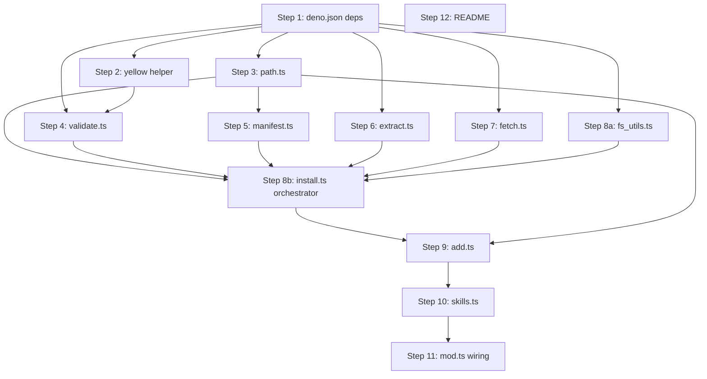

# Implementation Plan — `huuma skills add`

> Derived from `CONTEXT.md` (glossary) and `docs/adr/0001-huuma-skills-add.md`
> (decisions). Read those first — this plan does not re-justify the choices,
> it sequences the build.

## Goal

Ship `huuma skills add --path=<github-url> [--force]` that installs a skill
from a public GitHub repo into `<cwd>/.agents/skills/<name>/`, validated against
the Agent Skills spec, with a content-hash manifest and stage-then-swap
atomicity.

## Conventions

- **Deno + TypeScript**, matches the existing codebase.
- **No external binary deps** (no `git`); network via `fetch` + `DecompressionStream`.
- **`@std/*` only** for new dependencies: `@std/cli`, `@std/tar`, `@std/front-matter`,
  `@std/yaml`, plus already-used `@std/assert`, `@std/path`.
- **Tests**: non-network logic tested offline with `testdata/` fixtures;
  live-network tests declare `permissions: { net: true }` and self-skip when
  net is unavailable.
- **Output style**: `dim("… " + msg)` progress lines; `green("✓")` success;
  `red("✖")` + `console.error` + `Deno.exitCode = 1` + `return ""` failure;
  new `yellow` helper for warnings.

## File map (new + modified)

```
cli/
├── deno.json                       [modify] add @std/cli, @std/tar, @std/front-matter, @std/yaml; bump test task
├── README.md                       [modify] add `skills` row to command table + a "Skills" section
├── src/
│   ├── mod.ts                      [modify] register `skills` command in defaultCommands
│   ├── terminal.ts                 [modify] add `yellow` helper
│   └── skills/                     [new]
│       ├── skills.ts               [new] parent command, owns Registry of subcommands, help
│       ├── skills_test.ts          [new] --help / no-subcommand / unknown-subcommand tests
│       ├── add.ts                  [new] the `add` subcommand entry point + arg parsing
│       ├── add_test.ts             [new] arg-parsing, help, missing-required-flag, end-to-end with fakes
│       ├── path.ts                 [new] URL grammar parse + validate (Q2/Q3)
│       ├── path_test.ts            [new] accepts/rejects cases from the ADR examples
│       ├── fetch.ts                [new] codeload tarball download + gzip + @std/tar streaming
│       ├── fetch_test.ts           [new] offline: feed a fixture tarball, assert extracted tree
│       ├── extract.ts              [new] subpath filter + safety guards (traversal, symlinks, size cap)
│       ├── extract_test.ts         [new] traversal/symlink/size-cap + subpath-filter unit tests
│       ├── validate.ts             [new] SKILL.md frontmatter validation (4 mandatory + optional warnings)
│       ├── validate_test.ts        [new] valid/invalid SKILL.md fixtures
│       ├── manifest.ts             [new] read/write .agents/skills/.manifest.json; content hash; findCollision + detectLocalEdits
│       ├── manifest_test.ts        [new] round-trip, pure findCollision, detectLocalEdits, hash stability
│       ├── fs_utils.ts             [new] sweepStaleTemps + swapDirectory + randomSuffix (Step 8a)
│       ├── fs_utils_test.ts        [new] sweep + swap + rollback-on-failure tests
│       ├── install.ts              [new] orchestrator wiring path/validate/manifest/extract/fetch/fs_utils (Step 8b)
│       ├── install_test.ts         [new] new install / same-source overwrite / different-source refuse / edited-skill refuse / --force
│       └── testdata/               [new]
│           ├── valid-skill/        [new] minimal valid SKILL.md + an asset file
│           ├── invalid-name/       [new] bad `name` frontmatter
│           ├── missing-skill-md/   [new] dir with no SKILL.md
│           ├── optional-warnings/  [new] `compatibility` over 500 chars etc.
│           └── manifest.fixture.json
```

> **Note on `testdata/tarballs/`**: deliberately _omitted_. Tarball fixtures
> for `extract_test.ts` and `fetch_test.ts` are constructed **in-memory** with
> `@std/tar`'s `Tar` writer at test time. This keeps the repo free of binary
> blobs, makes the tests deterministic, and lets each probe (traversal,
> symlink, size-cap, subpath filter) build exactly the tarball shape it needs.
> The one exception is `fetch_test.ts`'s live-network test, which hits a real
> codeload URL and is self-skipped when offline.

## Implementation order

The plan is sequenced so each step depends only on earlier ones. Tests are
written alongside each module (not deferred to the end) so each commit is
verifiable in isolation.

### Dependency graph



### Parallelisable batches

The dependency graph means these steps can be implemented in parallel by
different contributors without touching each other's files:

- **Batch A** (after Step 1): Steps 2, 3, 6, 7, 8a — all independent leaf
  modules with disjoint write sets (`terminal.ts`, `skills/path.ts`,
  `skills/extract.ts`, `skills/fetch.ts`, `skills/fs_utils.ts`).
- **Batch B** (after Step 3): Step 5 (`manifest.ts` imports the `Source` type
  from `path.ts` only).
- **Batch C**: Step 4 (`validate.ts`) is a leaf consumed only by the
  orchestrator; can be done any time after Step 1 (and benefits from Step 2's
  `yellow` for its warning rendering).
- **Integration**: Step 8b is the single join point that depends on
  3, 4, 5, 6, 7, 8a. After it, 9 → 10 → 11 are strictly sequential (command
  wiring), and 12 (README) is independent and can land any time.

### Module contract ground rules

To keep modules independently testable, these contracts are fixed up front:

- **`ParsedPath` and `Source`** are defined in `src/skills/path.ts` and
  re-exported. `Source = { owner, repo, ref, subpath }` is the sub-shape reused
  by `ManifestEntry.source`. No other module redefines these types.
- **Error classes live next to the module that throws them**:
  `PathParseError` (path.ts), `ValidationError` (validate.ts),
  `FetchError` (fetch.ts), `ExtractError` (extract.ts),
  `CollisionError` / `LocalEditsError` (install.ts). No shared `errors.ts`.
- **`SKILL.md` existence is checked by `validate.ts` only.** `extract.ts` just
  writes files; it does _not_ assert `SKILL.md` is present. This keeps
  `extract.ts` a pure tarball→disk function and avoids a redundant check.
- **Test seam for the orchestrator**: `installSkill` accepts an optional
  injected `fetch` function in its options, defaulting to the real
  `downloadTarball`. `add_test.ts` and `install_test.ts` use this seam to
  drive the orchestrator with an in-memory tarball — no live network needed
  for the behavioural tests.
- **No module imports `install.ts` except `add.ts`.** The orchestrator is the
  single place that knows about all the leaves.

### Step 1 — Dependencies and tooling

- `deno.json`:
  - `imports`: add `"@std/cli": "jsr:@std/cli@^1.0.30"`,
    `"@std/tar": "jsr:@std/tar@^0.1.10"`,
    `"@std/front-matter": "jsr:@std/front-matter@^1.0.9"`,
    `"@std/yaml": "jsr:@std/yaml@^1.1.1"`.
  - `tasks.test`: bump to
    `deno test --allow-run --allow-read --allow-env --allow-net --allow-write src/`.
- Run `deno cache src/mod.ts` (or `deno task check`) to refresh `deno.lock`.
  (This only validates that the new imports resolve; `mod.ts` doesn't import
  them until Step 11.)

**Depends on**: none (foundation step).
**Blocks**: all subsequent steps.
**Verify**: `deno task check` passes; `deno.lock` contains the new entries.

### Step 2 — `yellow` helper in `src/terminal.ts`

- Add `yellow` next to the existing `red`/`green`/`dim` helpers (same ANSI
  style). Export it.
- Extend the existing `terminal_test.ts` with an assertion for `yellow`.

**Depends on**: Step 1 (no new deps, but sequenced after for a clean baseline).
**Blocks**: Steps 4, 8b, 9 (warning rendering).
**Verify**: `deno test src/terminal_test.ts` passes.

### Step 3 — Path grammar: `src/skills/path.ts` + tests

Pure module, no I/O. The first thing to nail because everything downstream
consumes its output.

- Export `parsePath(input: string): ParsedPath` where
  `ParsedPath = { owner: string; repo: string; ref: string; subpath: string[] }`.
  Also export `Source = { owner: string; repo: string; ref: string; subpath: string[] }`
  as the sub-shape reused by `ManifestEntry.source` (see ground rules).
  `ParsedPath` and `Source` are structurally identical here; `Source` exists
  as a named type so `manifest.ts` imports a domain name rather than the
  path-parser's type.
- Export `formatSource(p: ParsedPath): string` → `"<owner>/<repo>@<ref>"` for
  display, and `codeloadUrl(p: ParsedPath): string` →
  `"https://codeload.github.com/<owner>/<repo>/tar.gz/<ref>"`.
- Throw a typed `PathParseError` with a helpful message on any rejection
  (non-`https`, non-`github.com`, no `tree/`, `/` in `<ref>`, empty
  `<owner>`/`<repo>`/`<ref>`, `.git` suffix, `blob/`).
- `path_test.ts`: cover the two ADR examples (accept), repo-root skill
  (`tree/main` with no subpath — accept), shorthand `owner/repo` (reject),
  `tree/feature/foo/skills/bar` (reject with the slash-in-ref hint),
  `blob/...` (reject), `http://` (reject), `.git` suffix (reject).

**Depends on**: Step 1.
**Blocks**: Steps 5, 8b, 9 (anything that consumes `ParsedPath`/`Source`).
**Verify**: `deno test src/skills/path_test.ts` passes; all ADR examples
behave as the ADR says.

### Step 4 — Validation: `src/skills/validate.ts` + tests + fixtures

Pure module. Input: the extracted skill dir on disk. Output: either ok (with
a list of optional warnings) or a typed validation error.

- Use `@std/front-matter` to pull the YAML block from `SKILL.md`, then
  `@std/yaml` to parse it to an object.
- Reject hard (throw `ValidationError`):
  1. no `SKILL.md` at the skill-dir root;
  2. `name` missing or fails `^[a-z0-9]+(-[a-z0-9]+)*$` or length 1–64;
  3. `name` ≠ skill dir's basename;
  4. `description` missing or length 1–1024.
- Warn (collect strings, do not throw): `compatibility` > 500 chars;
  `metadata` values that aren't strings; any other spec-defined optional
  field that's present but malformed. Return warnings to the caller, which
  prints them with `yellow`.
- `validate_test.ts`: fixtures under `src/skills/testdata/valid-skill/`,
  `invalid-name/`, `missing-skill-md/`, `optional-warnings/`. Cover every
  mandatory-invariant reject case and every optional-warn case.

**Depends on**: Steps 1 (front-matter/yaml), 2 (`yellow` for warnings).
**Blocks**: Step 8b.
**Verify**: `deno test src/skills/validate_test.ts` passes.

### Step 5 — Manifest: `src/skills/manifest.ts` + tests

Owns `.agents/skills/.manifest.json`. No network.

- Types:
  ```ts
  interface ManifestEntry {
    source: { owner: string; repo: string; ref: string; subpath: string[] };
    contentHash: string; // "sha256-<hex>"
    installedAt: string; // ISO 8601
  }
  interface Manifest {
    skills: Record<string, ManifestEntry>;
  }
  ```
- `readManifest(skillsDir: string): Promise<Manifest>` — returns
  `{ skills: {} }` when the file is missing or unparseable (treat as empty,
  don't crash; log a `yellow` warning when unparseable).
- `writeManifest(skillsDir: string, m: Manifest): Promise<void>` — atomic-ish:
  write to `.manifest.json.tmp` then `Deno.rename`.
- `contentHashOf(skillDir: string): Promise<string>` — walk the tree, sort
  relative paths, feed `path \0 bytes` into SHA-256; prefix `"sha256-"`.
  Skip the manifest file itself if it's inside the skill dir (it isn't — it
  lives at the skills root — but document the invariant).
- `findCollision(m: Manifest, name: string, source: Source):
"none" | "same-source" | "different-source"` — **pure**, no disk access.
  Compares `source` against `m.skills[name].source` (same `owner`/`repo`
  means `"same-source"`; ref/subpath differences are still `"same-source"`).
  `Source` is the sub-shape imported from `path.ts`.
- `detectLocalEdits(m: Manifest, name: string, skillsDir: string):
Promise<boolean>` — re-hashes the on-disk skill tree at
  `<skillsDir>/<name>/` via `contentHashOf` and compares to
  `m.skills[name].contentHash`. Returns `false` when the skill isn't in the
  manifest or has no on-disk dir. This is the only disk-touching collision
  helper; split out so `findCollision` stays pure and unit-testable without
  fixtures.
- `manifest_test.ts`: round-trip write+read; `findCollision` for all three
  pure outcomes (no fixture dir needed); `detectLocalEdits` true/false with
  a temp dir; hash is stable across two reads of the same tree; hash changes
  when a file changes.

**Depends on**: Step 3 (`Source` type).
**Blocks**: Step 8b.
**Verify**: `deno test src/skills/manifest_test.ts` passes.

### Step 6 — Extract (tarball walk + safety guards): `src/skills/extract.ts` + tests

Pure module operating on a `ReadableStream<Uint8Array>` (the gzip-decompressed
tarball bytes). No network here — the network lives in `fetch.ts`.

- `extractSkill(opts: {
  tarball: ReadableStream<Uint8Array>;
  subpath: string[];
  destDir: string;
  sizeCap: { totalBytes: number; perFileBytes: number };
}): Promise<void>`
- Pipeline:
  1. `@std/tar` `Untar` over the stream.
  2. The tarball's top dir is `<repo>-<ref>/` (or `<repo>-<shortsha>/`).
     Strip exactly one leading path segment from each entry, then keep only
     entries whose stripped path starts with `<subpath>/` (or equals
     `<subpath>` for the dir entry itself).
  3. For each kept entry:
     - **Path-traversal guard**: reject if the resolved path escapes
       `destDir` (`resolve(destDir, strippedPath)` must start with
       `resolve(destDir) + sep`). Any violation → throw and abort.
     - **Symlink guard**: skip symlink entries silently (don't write them,
       don't error).
     - **Size cap**: track `totalBytesWritten`; throw if it would exceed
       `totalBytes`. Per-file: throw if an entry's declared size exceeds
       `perFileBytes`.
     - Directories: `Deno.mkdir(destDir + relPath, { recursive: true })`.
     - Files: `Deno.writeFile(...)`.
  4. **Do not** post-check for `destDir/SKILL.md` — that's `validate.ts`'s
     job (see ground rules). `extract.ts` is a pure tarball→disk function.
- Constants: `SIZE_CAP = { totalBytes: 50 * 1024 * 1024, perFileBytes: 10 * 1024 * 1024 }`
  (exported so tests can shrink them).
- `extract_test.ts`: build tarballs **in-memory** with `@std/tar`'s `Tar`
  writer (no network, no fixture files), including:
  - normal skill with nested `scripts/` and `assets/`;
  - subpath filter correctly excludes sibling dirs;
  - `../` traversal entry → abort;
  - symlink entry → skipped, install proceeds;
  - file exceeding `perFileBytes` → abort;
  - tarball whose total exceeds `totalBytes` → abort;
  - top-dir name uses `<shortsha>` form (not just `<ref>`).
- **Depends on**: Step 1.
- **Blocks**: Step 8b.
- No `testdata/tarballs/` fixtures — see the file-map note above.

**Verify**: `deno test src/skills/extract_test.ts` passes; each guard fires
on its probe.

### Step 7 — Fetch: `src/skills/fetch.ts` + tests

Thin network wrapper. Small surface so the network is easy to mock.

- `downloadTarball(url: string): Promise<ReadableStream<Uint8Array>>`:
  - `fetch(url, { redirect: "follow" })`.
  - On non-2xx (notably 404 for a bad ref): throw `FetchError` with a
    message like `"Ref '<ref>' not found in '<owner>/<repo>' (HTTP 404)"`.
  - On network error: throw `FetchError` wrapping the cause.
  - Return `response.body.pipeThrough(new DecompressionStream("gzip"))`.
- Optional: a small `withTimeout(promise, ms)` to avoid hangs on slow
  codeload responses (e.g. 30s). Document the timeout constant.
- `fetch_test.ts`:
  - Offline test using a local `Deno.serve` on an ephemeral port. The test
    builds a tarball in-memory (`@std/tar` `Tar` writer), gzips it with
    `CompressionStream("gzip")`, and serves it; assert the returned stream
    decodes to the expected bytes.
  - 404 test against the local server → `FetchError`.
  - One live-network test, gated with `permissions: { net: true }` and a
    self-skip guard (probe `https://example.com` in a `try`/`catch`; `return`
    on failure), hitting a known-stable small public repo tarball and
    asserting non-empty bytes. Keep this test fast and resilient.

**Depends on**: Step 1.
**Blocks**: Step 8b.
**Verify**: `deno test src/skills/fetch_test.ts` passes online and offline
(offline skips only the live test).

### Step 8a — Filesystem helpers: `src/skills/fs_utils.ts` + tests

Pure filesystem utilities extracted from the orchestrator so they can be
unit-tested in isolation without spinning up a network mock. No dependencies
on any other `skills/*` module.

- `sweepStaleTemps(skillsDir: string): Promise<void>` — list entries in
  `skillsDir` whose names match `.tmp-*` or `.old-*` and `Deno.remove` them
  recursively. Swallow all errors (best-effort cleanup of crashed prior runs);
  log nothing on success.
- `swapDirectory(opts: {
  tempDir: string;
  target: string;
}): Promise<void>` — atomic-ish stage-then-swap:
  1. If `target` does not exist: `Deno.rename(tempDir, target)`. Done.
  2. If `target` exists: pick `target + ".old-<rand>"`, `Deno.rename(target,
oldDir)`, then `Deno.rename(tempDir, target)`. If the second rename
     fails, attempt `Deno.rename(oldDir, target)` to restore, then rethrow.
  3. On success of step 2, recursively `Deno.remove(oldDir)`.
- `randomSuffix(): string` — small helper (e.g. `crypto.randomUUID()`'s first
  8 hex chars) used by `swapDirectory` and the orchestrator's temp dir name.
  Centralised so the naming scheme is in one place.
- `fs_utils_test.ts` against a temp dir (`Deno.makeTempDir`):
  - `sweepStaleTemps` removes `.tmp-foo` and `.old-bar` but leaves
    `mcp-builder/` and `.manifest.json` untouched.
  - `sweepStaleTemps` on a non-existent dir resolves without throwing.
  - `swapDirectory` into a non-existent target → single rename, target now
    exists, temp dir gone.
  - `swapDirectory` over an existing target → old content moved to `.old-*`,
    new content at `target`, `.old-*` deleted.
  - `swapDirectory` when the second rename fails (simulate by making
    `target` a non-empty dir that can't be replaced — or by stubbing) →
    old content restored to `target`.

**Depends on**: Step 1 (deps for `@std/path` if used).
**Blocks**: Step 8b.
**Verify**: `deno test src/skills/fs_utils_test.ts` passes.

### Step 8b — Install orchestrator: `src/skills/install.ts` + tests

This is where the pieces meet. No arg parsing here — takes a `ParsedPath` and
a `--force` boolean. Depends on 3 (path), 4 (validate), 5 (manifest),
6 (extract), 7 (fetch), 8a (fs_utils).

- `installSkill(opts: {
  parsed: ParsedPath;
  force: boolean;
  cwd: string;
  // Test seam: inject an alternative for the network step. Defaults to the
  // real `downloadTarball`from`fetch.ts`. `add_test.ts`and
  //`install_test.ts` pass an in-memory version to avoid live network.
  fetch?: (url: string) => Promise<ReadableStream<Uint8Array>>;
}): Promise<InstallResult>`:
  1. Print `dim("… Resolving <owner>/<repo>@<ref>")`.
  2. `sweepStaleTemps(skillsDir)` (from `fs_utils.ts`) — remove `.tmp-*` and
     `.old-*` dirs (best-effort, swallow errors).
  3. `downloadTarball(codeloadUrl(parsed))` → stream.
  4. Create `.agents/skills/.tmp-<name>-<rand>/`. **Subtlety**: we don't know
     `<name>` until we've read `SKILL.md`, which we can't read until we've
     extracted. So name the temp dir with a random suffix only:
     `.tmp-<rand>/`, extract into it (the extract module strips the tarball's
     top dir and filters by `subpath`, so the temp dir ends up containing the
     skill contents directly — `SKILL.md`, `scripts/`, ...).
  5. Print `dim("… Extracting <subpath-or-root>")`.
  6. Print `dim("… Validating SKILL.md")`. Run `validate(tempDir)`. On
     `ValidationError`: delete temp dir, rethrow (caller renders as red).
     On success, get `name` from frontmatter; collect warnings.
  7. Compute `skillsDir = <cwd>/.agents/skills`, `target = skillsDir/<name>`.
  8. Load manifest. Compute collision state via **two calls** (split so the
     pure source comparison is testable without disk, per the Step 5
     contract):
     - `findCollision(manifest, name, parsed.source)` — pure, returns one of
       `"none"`, `"same-source"`, `"different-source"`.
     - `detectLocalEdits(manifest, name, skillsDir)` — only called when
       `findCollision` is not `"none"` _and_ the skill dir exists on disk.
       Re-hashes the installed tree and compares to
       `manifest.skills[name].contentHash`. Returns boolean.

     Decision matrix (`force` is the `--force` flag):

     | `findCollision`    | `detectLocalEdits` | `force` | Action                        |
     | ------------------ | ------------------ | ------- | ----------------------------- |
     | `none`             | n/a                | any     | proceed to swap               |
     | `same-source`      | false              | any     | proceed (overwrite)           |
     | `same-source`      | true               | false   | throw `LocalEditsError`       |
     | `same-source`      | true               | true    | proceed (discard local edits) |
     | `different-source` | n/a                | false   | throw `CollisionError`        |
     | `different-source` | n/a                | true    | proceed (swap sources)        |

  9. Print `dim("… Installing to .agents/skills/<name>/")`.
  10. Stage-then-swap via `swapDirectory({ tempDir, target })` from
      `fs_utils.ts`. (The rollback-on-failure logic lives there, tested in
      Step 8a, not duplicated here.)
  11. Compute `contentHashOf(target)`, update the manifest entry for `name`
      (source from `parsed`, hash, `installedAt = new Date().toISOString()`),
      `writeManifest`.
  12. Return `{ name, target, warnings }`.

- The caller (`add.ts`) renders success (`green("✓")` + summary) and any
  warnings (`yellow`).
- `install_test.ts` — the heart of the test suite. Uses the `fetch` test
  seam to feed an in-memory tarball (built with `@std/tar` `Tar` writer),
  so the orchestrator is exercised end-to-end with **no live network** and
  no `Deno.serve`:
  - Fresh install: assert `SKILL.md` lands at the right path, manifest
    entry written, hash matches.
  - Re-add same source: overwrite succeeds, manifest hash refreshed.
  - Re-add different source, no `--force`: refuses with the right message,
    original install untouched.
  - Re-add different source with `--force`: overwrites, manifest source
    updated.
  - Edit a file in the installed skill, re-add same source, no `--force`:
    refuses with the local-edits message.
  - Same as above with `--force`: overwrites.
  - Validation failure (bad `name` in served tarball): temp dir cleaned up,
    no partial install left behind, exit code set, red message.
  - Path-traversal entry in served tarball: aborted, no files written
    outside the target.
  - `swapDirectory` rollback path is covered in Step 8a; the orchestrator
    test only needs to confirm the orchestrator _calls_ `swapDirectory` and
    handles a thrown `ExtractError`/`ValidationError` by cleaning the temp
    dir.

**Note on forced sequencing**: the collision check (step 8) happens _after_
download+extract+validate (steps 3–6) because the incoming skill's `name` is
unknown until `SKILL.md` is read. This means a refused collision still pays
the network cost. This is accepted in v1 — optimising it would require a
pre-download source-only check, which can't disambiguate two same-named
skills from different subpaths of the same repo without the frontmatter.

**Depends on**: Steps 3, 4, 5, 6, 7, 8a.
**Blocks**: Step 9.
**Verify**: `deno test src/skills/install_test.ts` passes; manual `ls` after
each test confirms no stray `.tmp-`/`.old-` dirs.

### Step 9 — `add` subcommand: `src/skills/add.ts` + tests

- Use `@std/cli` `parseArgs` with:
  ```ts
  parseArgs(args, {
    string: ["path"],
    boolean: ["force", "help"],
    alias: { help: "h" },
    default: { force: false, help: false },
    unknown: (arg) => {
      throw new Error(`Unknown option: ${arg}`);
    },
  });
  ```
- Flow:
  1. Parse args; on unknown option or missing `--path` → print usage to
     stderr, `Deno.exitCode = 1`, `return ""`.
  2. If `--help`/`-h` → `return addHelp()`.
  3. `parsePath(parsed.path)` — on `PathParseError`, render red, exit 1,
     return `""`.
  4. `await installSkill({ parsed, force: parsed.force, cwd: Deno.cwd() })`.
  5. On `InstallError`/`CollisionError`/`LocalEditsError`/`ValidationError`/
     `FetchError`: render red message, `Deno.exitCode = 1`, `return ""`.
  6. On success: print `green("✓")` summary line, then any warnings (each
     `yellow`), `return ""`.
- `addHelp()` follows the existing `project --help` format: USAGE, OPTIONS,
  one-line example using the ADR's canonical URL.
- `add_test.ts`:
  - `add(["--help"])` and `add(["-h"])` return usage containing
    `huuma skills add` and `--path`.
  - `add([])` (missing `--path`) → exit 1, red message naming `--path`.
  - `add(["--path", "not-a-url"])` → red, exit 1 (PathParseError rendered).
  - `add(["--bogus"])` → unknown-option error.
  - Success/warning rendering: `add.ts` exports an internal `runAdd(args,
deps?)` where `deps.fetch` threads through to `installSkill`'s seam. The
    default export calls `runAdd(args)` with no deps. `add_test.ts` calls
    `runAdd` with an in-memory `fetch` to assert the success path renders
    `green("✓")` and that `--force` flows through to `installSkill`. This
    keeps the `Command` signature unchanged while giving tests a seam.

**Depends on**: Steps 3 (parsePath), 8b (installSkill), 2 (yellow/green).
**Blocks**: Step 10.
**Verify**: `deno test src/skills/add_test.ts` passes.

### Step 10 — Parent `skills` command: `src/skills/skills.ts` + tests

Mirror `src/project/project.ts`:

- Own `Registry`, register `add` (first sub-command). Later: `list`,
  `update`, `remove`.
- Default export `(args: string[] = []) => Promise<string>`:
  - `args.some(isHelpFlag)` or empty args → `return skillsHelp()` listing
    registered sub-commands.
  - First arg is the sub-command name; look it up in the registry.
  - Found → `await command(args.slice(1))`.
  - Not found → red error + `skillsHelp()`, `Deno.exitCode = 1`,
    `return ""`.
- `skills_test.ts`:
  - `skills([])` → returns help listing `add`.
  - `skills(["--help"])` and `skills(["-h"])` → same help.
  - `skills(["add", "--help"])` → delegates to `add` and returns add's help.
  - `skills(["bogus"])` → red, exit 1, help printed.

**Depends on**: Step 9.
**Blocks**: Step 11.
**Verify**: `deno test src/skills/skills_test.ts` passes.

### Step 11 — Wire into `src/mod.ts`

- `import skills from "./skills/skills.ts";`
- Add to `defaultCommands`:
  ```ts
  { names: ["skills"], description: "Manage skills for your project",
    command: skills }
  ```
- No short alias (per ADR Q10).
- `help()` automatically picks it up via `registry.all()`.

**Depends on**: Step 10.
**Blocks**: none (terminal step for command wiring).
**Verify**: `deno run -A src/mod.ts --help` shows a `skills` row;
`deno run -A src/mod.ts skills --help` shows the skills help;
`deno run -A src/mod.ts skills add --help` shows the add help.

### Step 12 — README

- Add a row to the Commands table: `skills  Manage skills for your project`.
- Add a new `## Skills` section after `## AI Agent` with:
  - One-paragraph intro referencing the Agent Skills spec.
  - `huuma skills add --path=...` usage, the accepted URL grammar (copy the
    ADR's grammar block), the two ADR examples.
  - Notes: public repos only in v1; `--force` to overwrite on collision or
    after local edits; skills install into `.agents/skills/`.

**Depends on**: none (independent of code; can land any time, but
logically last so the docs match what shipped).
**Blocks**: none.
**Verify**: visual review; optional `deno task test` still green.

## Final validation

1. `deno task check` — type-check the whole tree.
2. `deno task test` — full suite, online and offline.
3. Manual smoke test from the repo root:
   ```
   deno run -A src/mod.ts skills add \
     --path=https://github.com/anthropics/skills/tree/main/skills/mcp-builder
   ```
   Expect: progress lines, `green("✓")`, and
   `.agents/skills/mcp-builder/SKILL.md` present with a manifest entry.
4. Re-run the same command → same-source overwrite succeeds.
5. Edit `.agents/skills/mcp-builder/SKILL.md`, re-run → local-edits refuse;
   re-run with `--force` → overwrites.
6. Try a bad path (`owner/repo` shorthand) → red error, exit 1, no files
   written.
7. Try `tree/feature/foo/skills/bar` → slash-in-ref rejection message.
8. `git status` shows the new files, `CONTEXT.md`, `docs/adr/`, `PLAN.md`,
   and the installed `.agents/skills/mcp-builder/` (the latter is a runtime
   artifact — do not commit it; `.gitignore` already excludes `.huuma`/
   `.huumadist` but not `.agents/`. Flag this to the user — see Open
   Questions below).

## Open questions for the user (not blockers for implementation)

1. **`.agents/` in `.gitignore`?** The installed skills under
   `.agents/skills/` are runtime artifacts (per-snapshot, possibly large,
   contain third-party code). Should `.agents/` be gitignored by
   `huuma project` scaffolds going forward, or should committed skills be
   encouraged (reproducible agent behavior across a team)? This is a real
   product decision and outside this ADR's scope.
2. **Manifest in `.gitignore`?** If `.agents/` is committed, the manifest
   _should_ be committed too (so `update` can detect drift). If
   `.agents/` is ignored, the manifest is per-developer state.
3. **Update command timing.** This plan lands `add` only. When should we
   schedule `huuma skills update` / `list` / `remove`?

## Out of scope (per ADR)

`list`, `update`, `remove`; `/`-containing branch refs; private-repo auth;
commit-SHA fingerprinting; `git clone`-based fetch; `@std/cli` spinners;
short flag aliases (`-p`, `-f`); upward project-marker search.
